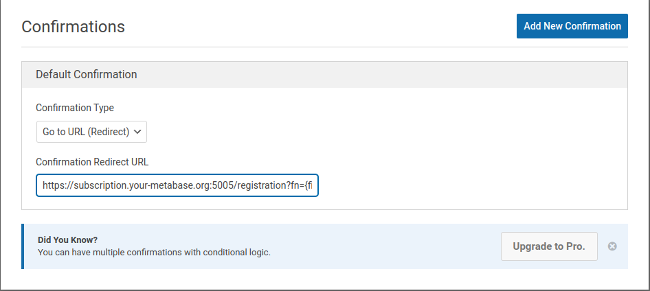

# metabase-registration-server
A Python Flask Server for Metabase Sign-ups via URL Redirect

## Configure

Edit the `scrtsxx.py` file with your metabase credentials and default Group ID

```shell
class MetabaseCredentials():
    username = "metabase adminstrator username"
    password = "password"
    GroupID  = 51
```

You can get your desired Group ID to add the new user to by issuing the following API commands:

First get a Metabase Session ID:

```shell
curl -X POST -H "Content-Type: application/json" -d '{"username" : "admin@your-metabase.org", "password" : "password"}' "http://localhost:3000/api/session"
```

You'll get output like:

```shell
{"id":"e3414f4d-6387-4704-9f7c-c2929adc0389"}
```

Just copy the id and issuing the following command to get all Group IDs in your Metabase instance:

```shell
curl -X GET -H "Content-Type: application/json" -H "X-Metabase-Session: e3414f4d-6387-4704-9f7c-c2929adc0389" "http://localhost:3000/api/permissions/group"
```

## Running

Simply issue the following command with your server public IP address and desired port:

```shell
./app_run.sh x.x.x.x --port 5005
```

You will see the server spin up and it will be read for requests. 

## URL Redirects

In our case we use WP Forms to create a form for basic information needed by the Metabase server to create a new user:

* First Name
* Last Name
* E-mail address

We have WP Forms issue a redirect to our Flask Metabase Registration Server as ran in the previous section. Make sure to include the field names like such: 

```shell
https://subscription.your-metabase.org:5005/registration?fn={field_id="0"}&ln={field_id="1"}&email={field_id="2"}
```




# Donations

We are a small dev team with very little funding. Please buy us a coffee with crypto!

## BTC (Bitcoin)

`bc1qtvc9l3cr9u4qg6uwe6pvv7jufvsnn0xxpdyftl`


## DVPN (Sentinel)

`sent12v8ghhg98e2n0chyje3su4uqlsg75sh4lwcyww`


## XMR (Monero)

`87qHJPU5dZGWaWzuoC3My5SgoQSuxh4sHSv1FXRZrQ9XZHWnfC33EX1NLv5HujpVhbPbbF9RcXXD94byT18HonAQ75b9dyR`


## ARRR (Pirate Chain)

`zs1gn457262c52z5xa666k77zafqmke0hd60qvc38dk48w9fx378h4zjs5rrwnl0x8qazj4q3x4svz`


